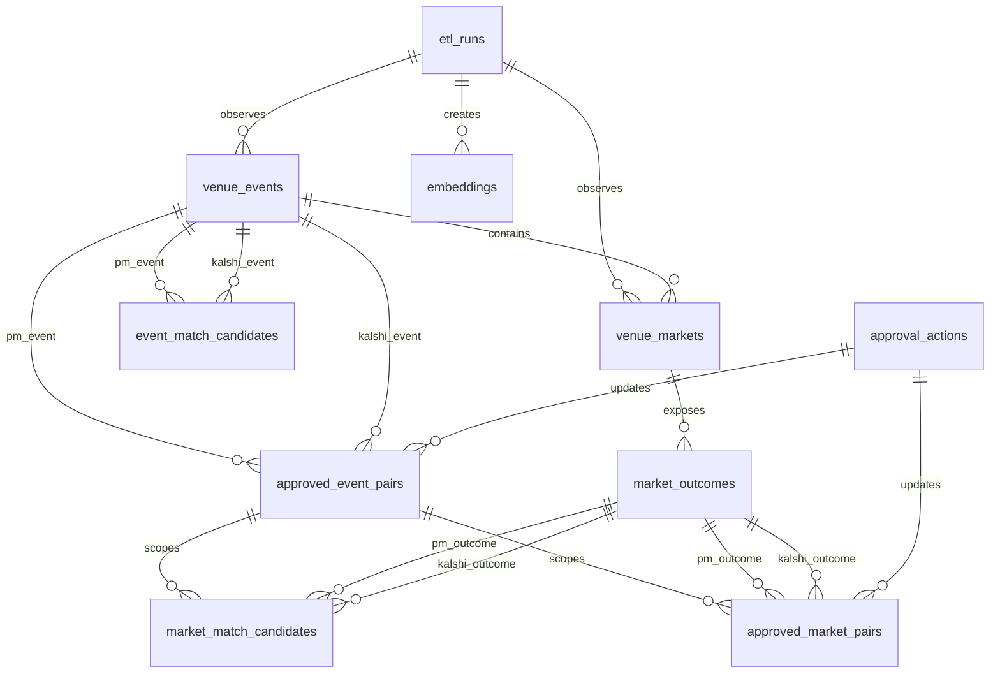

# Cloud Database Design

This design moves the cross-venue event/market matching workflow from CSV-first review files to a cloud-backed operational database while preserving GCS raw snapshots and a human approval gate.

## Storage Choice

Use **Cloud SQL for PostgreSQL** as the operational database.

Why this fits this project:

- Event, market, event-pair, and market-pair data are relational and need durable approval state.
- The dashboard needs fast filters, joins, and manual review writes.
- Daily runs need incremental upserts and lifecycle transitions such as `active`, `expired`, and `settled`.
- Raw venue payloads and large historical artifacts can still live in GCS as parquet/csv snapshots.

GCS remains the raw data lake:

- `raw/run_date=YYYY-MM-DD/...` stores raw API pulls.
- `processed/latest/...` keeps review-friendly exports.
- Cloud SQL stores normalized current state, review state, and links back to raw snapshot URIs.

BigQuery can be added later for analytics, but it should not be the primary approval database.

## Core Tables



Important table groups:

- `venue_events`: one row per venue event container, e.g. Polymarket event or Kalshi event ticker.
- `venue_markets`: one row per venue market/contract.
- `market_outcomes`: one row per tradable outcome side, e.g. PM named outcome/token or Kalshi yes/no candidate contract.
- `event_match_candidates`: Vertex/Gemini-generated event pair suggestions awaiting approval.
- `approved_event_pairs`: user-approved event-level PM/Kalshi pairings.
- `market_match_candidates`: Vertex/Gemini-generated market/outcome suggestions inside approved event pairs.
- `approved_market_pairs`: user-approved market/outcome pairs used by scanners.
- `embeddings`: cached event/market fact embeddings keyed by text hash and model.
- `approval_actions`: append-only audit log of user approval/rejection actions.

## Lifecycle Model

Use two separate concepts:

- `status`: venue-reported status, such as `open`, `active`, `closed`, `settled`, `resolved`.
- `lifecycle_status`: our operational state, one of:
  - `active`: visible in current active universe.
  - `expired`: no longer active or past close/expiration.
  - `settled`: venue explicitly reports settled/resolved.
  - `archived`: retained but no longer used.

Daily expiration logic:

1. Each daily run fetches the complete active event and market universe from both venues.
2. Upsert all observed events, markets, and outcomes, updating `last_seen_at` and `last_seen_run_id`.
3. Any previously active event/market not seen in the current complete active pull becomes `expired`.
4. Any event/market with close/expiration before the run time becomes `expired`, unless the venue reports `settled`, in which case it becomes `settled`.
5. Approved event pairs become `expired` when either linked event is expired/settled.
6. Approved market pairs become `expired` when either linked market/outcome is expired/settled.

This keeps old approvals for history while preventing stale pairs from feeding live scanners.

## Daily Incremental Workflow

Cloud Scheduler runs a daily Cloud Run Job:

```text
daily_universe_sync
-> fetch all active Polymarket events/markets with pagination
-> fetch all active Kalshi events/standalone markets with pagination
-> write raw snapshots to GCS
-> upsert venue_events, venue_markets, market_outcomes
-> expire missing or past-close records
-> embed only new/changed event fact text with Vertex AI
-> create event_match_candidates for new/unapproved PM events
-> for approved active event pairs, embed only new/changed market fact text
-> create market_match_candidates inside each approved event pair
-> stop before approval
```

Human approval is the final gate:

```text
dashboard review
-> approve/reject event candidates
-> approve/reject market candidates
-> append approval_actions
-> update approved_event_pairs / approved_market_pairs
```

Live price scans should read only:

```sql
approved_market_pairs.lifecycle_status = 'active'
AND approved_market_pairs.review_status = 'approved'
```

## Vertex AI Usage

Use Vertex AI for candidate generation, not final authority.

Event matching:

- Input text: venue, event title, subtitle, category, series/product metadata, settlement summary.
- Cache by `(entity_type, entity_key, provider, model, dimension, text_hash)`.
- Embed only new text hashes each day.
- Write top candidates to `event_match_candidates`.

Market matching:

- Only run inside approved active event pairs.
- Input text: event title, market title, outcome/side, all outcomes, rules/description, settlement summary, close/expiration, source/resolution.
- Generate top-1 or top-N candidates depending dashboard needs.
- Do not auto-approve. Write to `market_match_candidates`.

Text reviewer:

- Optional. If enabled, it should populate `ai_recommendation` and `ai_reason`, not change approval state.
- The final state changes only through user approval.

## Approval Policy

For this project, event-pair approval means:

> The two venue event containers refer to the same real-world event, metric, or settlement object.

Market-pair approval means:

> The two venue market/outcome rows are the same practical trading exposure inside an approved event pair.

Do not over-reject solely because one venue has extra fallback clauses, but do reject obvious differences:

- Different named subject/team/candidate.
- Different side or opposite outcome.
- Different metric, line, threshold, date window, or period.
- Match winner vs total/spread/set/halftime unless explicitly intended.
- Broad market container without matching outcome side.

## Current Approved Seed

The current bulk-approved market pairs have been written locally to:

```text
data/cross_sports_arbitrage/manual_review/approved_mappings/current.csv
data/cross_sports_arbitrage/manual_review/approved_market_pairs/current.csv
```

When cloud ingestion is implemented, load these as seed rows for:

- `approved_market_pairs`
- `approval_actions`

The richer `approved_market_pairs/current.csv` preserves titles and settlement summaries; the legacy `approved_mappings/current.csv` exists for dashboard/scanner compatibility.

## Recommended Cloud Run Jobs

Add these jobs to the existing GCP stack:

- `daily-active-universe-sync`
  - Runs once per day.
  - Fetches complete active PM/Kalshi universe.
  - Upserts Cloud SQL normalized tables.
  - Writes raw snapshots to GCS.
  - Marks expired/settled records.

- `daily-match-candidates`
  - Can be same container/job after sync or a separate job.
  - Uses Vertex AI cached embeddings.
  - Writes event and market candidate tables.
  - Does not approve anything.

- `approved-pair-price-snapshot`
  - Reads approved active market pairs from Cloud SQL.
  - Pulls prices/orderbooks.
  - Writes quote snapshots and strategy signals.

## Implementation Status

Done:

- Cloud SQL PostgreSQL, Secret Manager credentials, IAM, Cloud Run Jobs, Cloud Scheduler, Artifact Registry, and GCS are managed by Terraform.
- `infra/gcp/sql/prediction_market_schema.sql` is applied by the daily pipeline before ingestion.
- `poly-x-kalshi-cloud-daily-pipeline` fetches the complete active PM/Kalshi universe, upserts normalized events/markets/outcomes into Cloud SQL, expires missing rows, seeds approved market pairs, writes latest GCS tables, and generates candidate tables.
- The deployed daily Cloud Run Job uses 4 vCPU, 16Gi, a 14,400 second timeout, and bounded parallel Kalshi event-market fetch workers.
- Latest CSV/parquet exports remain in GCS for manual inspection and dashboard fallback.
- GitHub Actions runs tests, Terraform fmt/validate, Docker build, and a manual deployment workflow.

Remaining:

- Move dashboard approval writes from CSV/GCS-first storage to Cloud SQL-first writes with CSV/GCS export as backup.
- Add a dedicated approved-pair price snapshot job that reads active approved market pairs directly from Cloud SQL.
